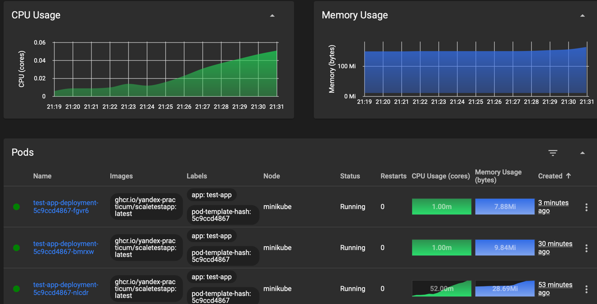
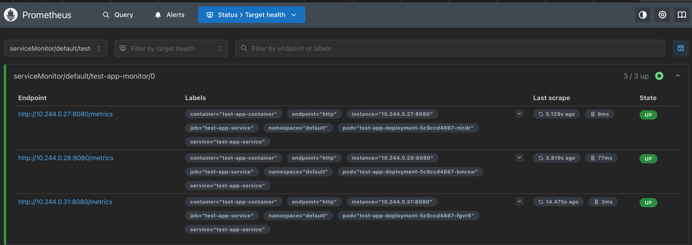
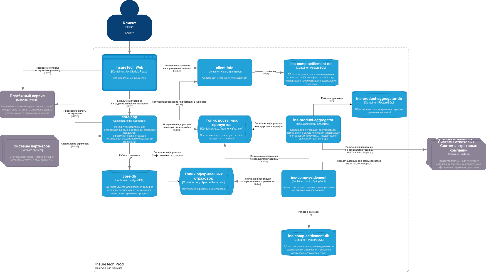

# Сдача проектной работы 8 спринта
## Задание 1. Проектирование технологической архитектуры

### AS IS


### TO BE


## Задание 2. Динамическое масштабирование контейнеров
### Часть 1. Динамическая маршрутизация на основании показателей утилизации памяти

#### 1. Поднимите локальный кластер Kubernetes в Minikube.
```shell
minikube start
```
#### 2. Активируйте metrics-server
```shell
minikube addons enable metrics-server
```
#### 3. Загружаем приложение и загружаем созданный манифест

```shell
docker pull ghcr.io/yandex-practicum/scaletestapp:sha256-eff20ae3ae2d596375f9ed6d612a78d149a35a66cd2907ea90d7175ca918c993.sig
```
У меня сработало вот так:
```shell
docker pull ghcr.io/yandex-practicum/scaletestapp:latest --platform linux/amd64
```
Далее:
```shell
docker save ghcr.io/yandex-practicum/scaletestapp:latest -o scaletestapp.tar
minikube image load scaletestapp.tar
```
Загружаем манифест:
```shell
kubectl apply -f Task2/deployment.yaml
```

#### 4. Примените манифест сервиса (Service)
```shell
kubectl apply -f Task2/service.yaml
```
#### 4. Настройте динамическую маршрутизацию
```shell
kubectl apply -f Task2/hpa.yaml
```
#### 4. Теперь проверки:
Воспользуйтесь инструментом нагрузочного тестирования locust:
```shell
pip3 install locust
```
```shell
cd Task2
```
```shell
locust
```
Состояние HPA, видно, что при достижении порога, количество реплик увеличилось до 3 подов:
```
NAME           REFERENCE                        TARGETS           MINPODS   MAXPODS   REPLICAS   AGE
test-app-hpa   Deployment/test-app-deployment   memory: 70%/80%   2         10        2          18m
test-app-hpa   Deployment/test-app-deployment   memory: 70%/80%   2         10        2          18m
test-app-hpa   Deployment/test-app-deployment   memory: 71%/80%   2         10        2          19m
test-app-hpa   Deployment/test-app-deployment   memory: 72%/80%   2         10        2          20m
test-app-hpa   Deployment/test-app-deployment   memory: 72%/80%   2         10        2          21m
test-app-hpa   Deployment/test-app-deployment   memory: 73%/80%   2         10        2          22m
test-app-hpa   Deployment/test-app-deployment   memory: 73%/80%   2         10        2          23m
test-app-hpa   Deployment/test-app-deployment   memory: 73%/80%   2         10        2          24m
test-app-hpa   Deployment/test-app-deployment   memory: 76%/80%   2         10        2          25m
test-app-hpa   Deployment/test-app-deployment   memory: 84%/80%   2         10        2          26m
test-app-hpa   Deployment/test-app-deployment   memory: 89%/80%   2         10        2          27m
test-app-hpa   Deployment/test-app-deployment   memory: 89%/80%   2         10        3          27m
test-app-hpa   Deployment/test-app-deployment   memory: 76%/80%   2         10        3          28m
```


### Часть 2. Динамическая маршрутизация на основании показателей количества запросов в секунду
#### 1. Установите Prometheus в вашем кластере.
```shell
helm install prometheus prometheus-community/kube-prometheus-stack \
  --namespace monitoring \
  --create-namespace \
  --set prometheus.service.type=NodePort \
  --set prometheus.service.nodePort=30090 \
  --set grafana.service.type=NodePort \
  --set grafana.service.nodePort=30091
```
#### 2. Настройте экспорт метрик из приложения в Prometheus.
```shell
kubectl apply -f Task2/service-monitor.yaml
```
#### 3. Проверьте, что метрики из вашего приложения поступают в Prometheus


#### 4. Настройте автоматическое масштабирование по RPS через HPA

```shell
helm install prometheus-adapter prometheus-community/prometheus-adapter \
-n monitoring \
-f Task2/values.yaml
```
```shell
kubectl kubectl delete hpa test-app-hpa
```
```shell
kubectl apply -f Task2/hpa-rps.yaml
```
Подали нагрузку и мониторим результаты масштабирования:
```
 kubectl get hpa test-app-hpa-rps -w
NAME               REFERENCE                        TARGETS   MINPODS   MAXPODS   REPLICAS   AGE
test-app-hpa-rps   Deployment/test-app-deployment   0/10      1         10        1          2d18h
test-app-hpa-rps   Deployment/test-app-deployment   0/10      1         10        4          2d18h
test-app-hpa-rps   Deployment/test-app-deployment   0/10      1         10        5          2d18h
test-app-hpa-rps   Deployment/test-app-deployment   863m/10   1         10        5          2d18h
test-app-hpa-rps   Deployment/test-app-deployment   1262m/10   1         10        5          2d18h
test-app-hpa-rps   Deployment/test-app-deployment   2513m/10   1         10        5          2d18h
test-app-hpa-rps   Deployment/test-app-deployment   3431m/10   1         10        5          2d18h
test-app-hpa-rps   Deployment/test-app-deployment   4696m/10   1         10        5          2d18h
test-app-hpa-rps   Deployment/test-app-deployment   5586m/10   1         10        5          2d18h
test-app-hpa-rps   Deployment/test-app-deployment   6559m/10   1         10        5          2d18h
test-app-hpa-rps   Deployment/test-app-deployment   8026m/10   1         10        5          2d18h
test-app-hpa-rps   Deployment/test-app-deployment   8952m/10   1         10        5          2d18h
test-app-hpa-rps   Deployment/test-app-deployment   9946m/10   1         10        5          2d18h
test-app-hpa-rps   Deployment/test-app-deployment   10946m/10   1         10        5          2d18h
test-app-hpa-rps   Deployment/test-app-deployment   11999m/10   1         10        5          2d18h
test-app-hpa-rps   Deployment/test-app-deployment   12719m/10   1         10        6          2d18h
test-app-hpa-rps   Deployment/test-app-deployment   13832m/10   1         10        6          2d18h
test-app-hpa-rps   Deployment/test-app-deployment   12361m/10   1         10        7          2d18h
test-app-hpa-rps   Deployment/test-app-deployment   13047m/10   1         10        7          2d18h
```

## Задание 3. Переход на Event-Driven архитектуру

### 1. Проанализируйте текущую архитектуру. Создайте текстовый документ и напишите там список проблем и рисков

Анализ и список проблем в файле [Проблемы и риски.md](Task3/Проблемы%20и%20риски.md)
Дублирую:
#### Проблемы:

1. Увеличение количества внешних страховых компаний, может привести к увеличению времени ответа сервиса ins-product-aggregator,
   что приведет к длительным http соединениям, а значит и повышению риска сбоев и таймаутов при взаимодействии МС.
2. Горизонтальное масштабирование сервисов core-app и ins-comp-settlement приведет к повышению соответствующего
   числа запросов к сервису ins-product-aggregator, а значит и к внешним страховым компаниям. Это может привести к
   негативному влиянию на внутренние и внешние взаимодействия, а также превышению согласованного SLA.
3. Повышение количества оформленных страховок будет прямо влиять на длительность получения этого списка. С учетом того,
   что запрос поступает раз в сутки, значит синхронное соединение будет открыто значительно долго, это повысит риск сбоев.
4. Несогласованность данных: Разные интервалы обновления кэша (15 мин vs сутки) приводят к рассинхронизации продуктов
   в core-app и ins-comp-settlement, что может вызвать ошибки при оформлении/реестре страховок.
5. Единая точка отказа: ins-product-aggregator, при его сбое оба сервиса работают с устаревшим кэшем.

### 2. Обновите диаграмму контейнеров, предложив решения для выявленных вами рисков и проблем.

Для взаимодействия между сервисами добавлены топики:
- Топик для передачи оформленных страховок. Данные могут поступать в топик сразу после оформления, 
а сервис ins-comp-settlement сможет получать данные с "комфортной" для него скоростью. Даже в случае сбоев, 
данные не будут утеряны, а при возобновлении работы ins-comp-settlement продолжит потреблять данные с того же места,
с которого остановился.
- Топик для передачи актуальной информации по страховым продуктам. Оба сервиса смогут читать информацию, 
не нагружая дополнительно сервис ins-product-aggregator и внешних поставщиков данных. Данные из топика 
будут обрабатываться по мере поступления, что снизит несогласованность данных в разных сервисах.

При отправки данных в топики, в сервисах core-app и ins-product-aggregator необходимо использовать
паттерн Transactional Outbox, чтобы гарантировать доставку всех данных.
Для этого к сервису ins-product-aggregator подключим БД (также отражено на схеме), которую будем использовать
для хранения данных от страховых, и технические таблицы для реализации паттерна.

